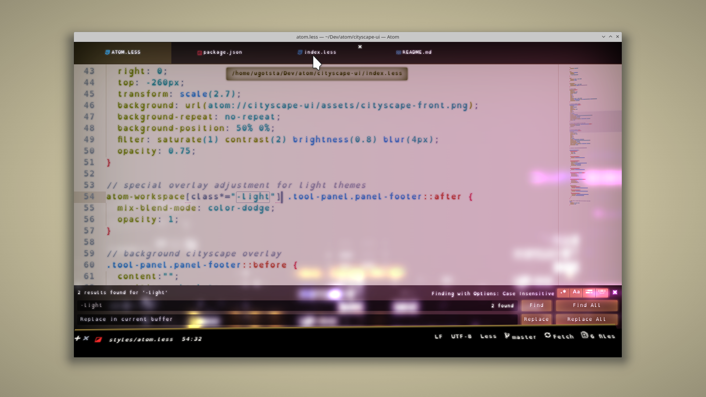
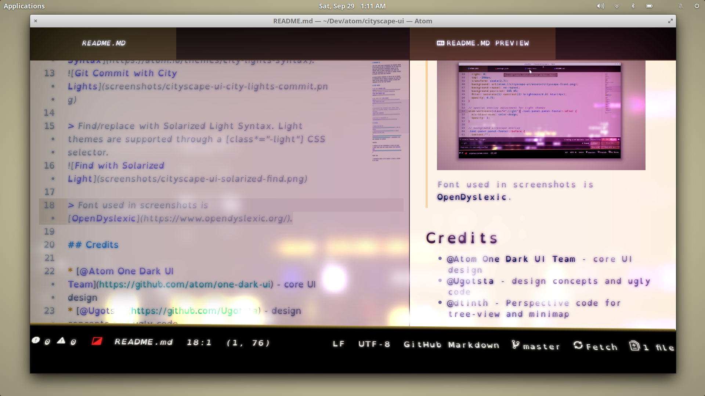

From your lofty suite overlooking the bustling lights of the city, you take to decorating the the night sky with your engineering brilliance. Humbled by the loftier tower of suites dominating your view, you seize the opportunity to use their ad display service to render your local file listing.

It could happen. Cityscape UI aims to see it happen. It overhauls many of Atom's UI elements and helps you focus on what really matters; itself. It wants your attention on its neon city lights.

## Pretty Neon Lights

> CSS with [Monokai Neon Syntax](https://atom.io/themes/monokai-neon-syntax). File list rendered on adjacent skyscraper.

> Git Commit with [City Lights Syntax](https://atom.io/themes/city-lights-syntax).

> Find/replace with Solarized Light Syntax. Light themes are supported through a [class*="-light"] CSS selector.

> Markdown preview using Solarized Light Syntax.

> Font used in screenshots is [OpenDyslexicMono](https://www.opendyslexic.org/).

## Animations

Subtle animations can be enabled using the "Enable animations" option in the theme settings. They're turned off by default to avoid CPU usage. Turn on if your CPU is too fast.

## Buildings demand attention

Vibrant neon buildings demand your attention but you can pay them none by toggling the "Push those pesky buildings back" option in theme settings. It's much easier to see your far more brilliant code this way.

## Credits

* [@Atom One Dark UI Team](https://github.com/atom/one-dark-ui) - core UI design
* [@Ugotsta](https://github.com/Ugotsta) - design concepts and ugly code
* [@dtinth](https://medium.com/hacking-atom/some-subtle-3d-effects-for-atom-d7a624a74fdd) - perspective code for tree-view and minimap

FEATURES

* Probably the most distracting UI theme for Atom.
* Works great with neon syntax themes like [Futurism Dark Syntax](https://atom.io/packages/futurism-dark-syntax).

KNOWN BUGS

* Ridiculous abuse of CSS ensures it can't be ported to VS Code.
